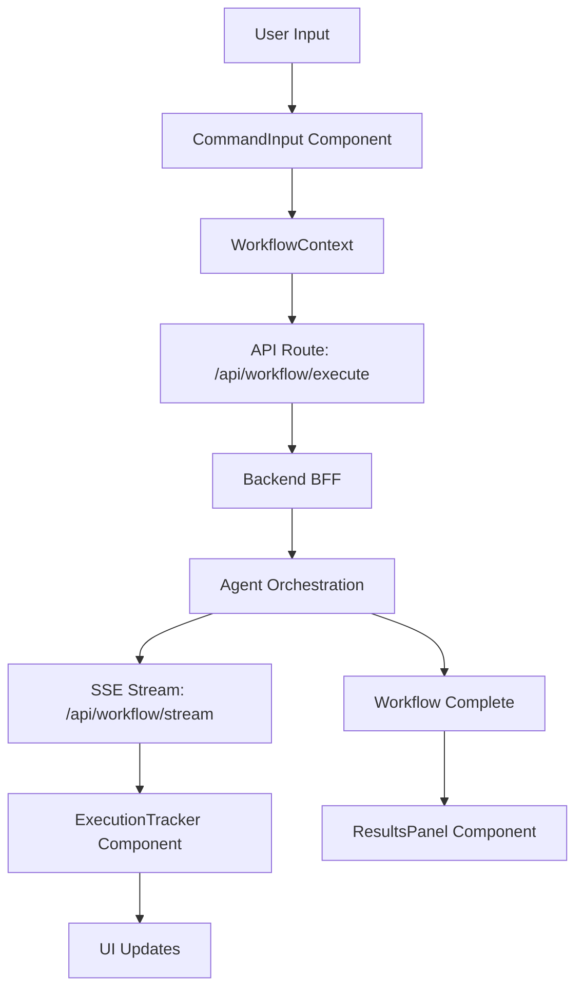

# Design Document

## Overview

The AURA UI System is a Next.js 15-based frontend application that provides an intuitive interface for users to interact with an AI-powered agent orchestration system. The design emphasizes real-time feedback, clarity of agent operations, and seamless integration with Google Workspace services. The architecture follows a component-based approach using React Server Components where appropriate, with client-side interactivity for real-time updates and user interactions.

The UI communicates with the backend through Next.js API routes, receiving real-time updates via Server-Sent Events (SSE) for workflow execution progress. State management is handled through React Context API and React hooks, eliminating the need for external state management libraries.

---

## Architecture

### High-Level Component Structure

```
app/
├── (auth)/
│   ├── login/
│   │   └── page.tsx
│   └── callback/
│       └── page.tsx
├── (dashboard)/
│   ├── layout.tsx
│   ├── page.tsx (Dashboard)
│   ├── history/
│   │   └── page.tsx
│   └── settings/
│       └── page.tsx
├── api/
│   ├── workflow/
│   │   ├── execute/route.ts
│   │   ├── cancel/route.ts
│   │   └── stream/route.ts (SSE endpoint)
│   ├── history/route.ts
│   └── auth/
│       └── status/route.ts
└── components/
    ├── layout/
    │   ├── TopNavigation.tsx
    │   ├── QuickActionsSidebar.tsx
    │   └── MobileBottomSheet.tsx
    ├── command/
    │   ├── CommandInput.tsx
    │   ├── PromptTemplates.tsx
    │   └── VoiceInput.tsx (future)
    ├── execution/
    │   ├── ExecutionTracker.tsx
    │   ├── StepProgress.tsx
    │   ├── AgentIndicator.tsx
    │   └── CancelButton.tsx
    ├── results/
    │   ├── ResultsPanel.tsx
    │   ├── ResultCard.tsx
    │   ├── ActionButtons.tsx
    │   └── FeedbackWidget.tsx
    ├── history/
    │   ├── HistoryList.tsx
    │   ├── HistoryItem.tsx
    │   ├── HistoryFilters.tsx
    │   └── TaskDetailModal.tsx
    ├── settings/
    │   ├── OAuthStatus.tsx
    │   ├── ScopesList.tsx
    │   └── DisconnectButton.tsx
    └── shared/
        ├── LoadingSpinner.tsx
        ├── ErrorBoundary.tsx
        └── Toast.tsx
```

### Data Flow Architecture



### State Management Strategy

The application uses React Context API for global state management, organized into domain-specific contexts:

1. **WorkflowContext** - Manages current workflow execution state
2. **AuthContext** - Handles authentication status and user session
3. **HistoryContext** - Manages task history and filtering
4. **SettingsContext** - User preferences and configuration

---

## Components and Interfaces

### 1. Command Input Component

**Purpose**: Primary interface for users to enter natural language commands

**Props Interface**:

```typescript
interface CommandInputProps {
  onSubmit: (command: string) => Promise<void>;
  disabled: boolean;
  placeholder?: string;
}
```

**State**:

- `inputValue: string` - Current text in input
- `charCount: number` - Character count
- `showTemplates: boolean` - Template dropdown visibility

**Key Features**:

- Auto-resize textarea (3-10 lines)
- Character counter
- Template suggestions dropdown
- Keyboard shortcuts (Ctrl+Enter to submit, Ctrl+K to focus)
- Input validation (minimum 10 characters)

---

### 2. Execution Tracker Component

**Purpose**: Display real-time progress of workflow execution

**Props Interface**:

```typescript
interface ExecutionTrackerProps {
  workflowId: string;
  onCancel: () => void;
}

interface WorkflowStep {
  id: string;
  agentName: string;
  action: string;
  status: "pending" | "running" | "completed" | "failed" | "cancelled";
  startTime?: Date;
  endTime?: Date;
  input?: any;
  output?: any;
  error?: string;
}
```

**State**:

- `steps: WorkflowStep[]` - Array of workflow steps
- `currentStepIndex: number` - Currently executing step
- `expandedSteps: Set<string>` - IDs of expanded step details

**Key Features**:

- Progress bar showing completion percentage
- Real-time step updates via SSE
- Expandable step details
- Agent icons and status indicators
- Estimated time remaining
- Cancel button

**SSE Event Handling**:

```typescript
interface SSEEvent {
  type: "step_start" | "step_complete" | "step_error" | "workflow_complete";
  stepId: string;
  data: WorkflowStep;
}
```

---

### 3. Results Panel Component

**Purpose**: Display workflow outputs and provide action buttons

**Props Interface**:

```typescript
interface ResultsPanelProps {
  results: WorkflowResult[];
  onFeedback: (resultId: string, rating: "positive" | "negative") => void;
}

interface WorkflowResult {
  id: string;
  type: "document" | "email" | "calendar" | "sheet" | "file";
  title: string;
  preview?: string;
  url?: string;
  metadata: Record<string, any>;
}
```

**Key Features**:

- Result cards with type-specific icons
- Preview for documents (first 500 chars)
- Action buttons (Open, Download, Share)
- Feedback widget (thumbs up/down)
- Copy to clipboard functionality

---

### 4. Quick Actions Sidebar Component

**Purpose**: Provide one-click access to common workflows

**Props Interface**:

```typescript
interface QuickActionsSidebarProps {
  onActionSelect: (template: string) => void;
}

interface QuickAction {
  id: string;
  title: string;
  description: string;
  template: string;
  icon: string;
  category: "email" | "docs" | "calendar" | "analysis";
  isFavorite: boolean;
  usageCount: number;
}
```

**State**:

- `actions: QuickAction[]` - All available quick actions
- `favorites: QuickAction[]` - User-favorited actions
- `recentActions: QuickAction[]` - Recently used (max 5)

**Key Features**:

- Categorized action list
- Favorites section
- Recent actions section
- Search/filter functionality
- Drag-to-reorder favorites

---

### 5. History List Component

**Purpose**: Display chronological list of past workflows

**Props Interface**:

```typescript
interface HistoryListProps {
  onItemSelect: (taskId: string) => void;
  onRerun: (taskId: string) => void;
}

interface HistoryItem {
  id: string;
  command: string;
  status: "success" | "failed" | "cancelled";
  timestamp: Date;
  duration: number;
  agentsUsed: string[];
  resultCount: number;
}
```

**State**:

- `items: HistoryItem[]` - Filtered history items
- `filters: HistoryFilters` - Active filters
- `sortBy: 'date' | 'duration' | 'status'` - Sort order

**Key Features**:

- Infinite scroll pagination
- Filter by date range, status, agent type
- Sort options
- Search by command text
- Re-run button
- Export to CSV

---

### 6. OAuth Status Component

**Purpose**: Display Google account connection status

**Props Interface**:

```typescript
interface OAuthStatusProps {
  onConnect: () => void;
  onDisconnect: () => void;
}

interface AuthStatus {
  isConnected: boolean;
  userEmail?: string;
  scopes: string[];
  expiresAt?: Date;
}
```

**Key Features**:

- Connection status indicator (green/red)
- User email display
- Scopes list with descriptions
- Connect/Disconnect buttons
- Token expiry warning

---

## Data Models

### Workflow Execution State

```typescript
interface WorkflowState {
  id: string;
  status: "idle" | "planning" | "executing" | "completed" | "failed" | "cancelled";
  command: string;
  steps: WorkflowStep[];
  results: WorkflowResult[];
  error?: string;
  startTime?: Date;
  endTime?: Date;
}
```

### User Session

```typescript
interface UserSession {
  userId: string;
  email: string;
  isAuthenticated: boolean;
  oauthStatus: AuthStatus;
  preferences: UserPreferences;
}

interface UserPreferences {
  theme: "light" | "dark" | "system";
  notificationsEnabled: boolean;
  defaultView: "dashboard" | "history";
  favoriteActions: string[];
}
```

### Task History Entry

```typescript
interface TaskHistoryEntry {
  id: string;
  userId: string;
  command: string;
  workflowState: WorkflowState;
  createdAt: Date;
  updatedAt: Date;
}
```

---

## Error Handling

### Error Types

1. **Network Errors** - Failed API requests
2. **Authentication Errors** - Expired or invalid tokens
3. **Validation Errors** - Invalid user input
4. **Workflow Errors** - Agent execution failures
5. **Timeout Errors** - Long-running operations

### Error Handling Strategy

**Global Error Boundary**:

- Catches React component errors
- Displays user-friendly error message
- Provides "Retry" and "Report" options
- Logs errors to monitoring service

**API Error Handling**:

```typescript
interface APIError {
  code: string;
  message: string;
  details?: any;
  retryable: boolean;
}
```

**User-Facing Error Messages**:

- Clear, non-technical language
- Suggested actions (e.g., "Try reconnecting your Google account")
- Support contact option
- Error code for debugging

**Toast Notifications**:

- Success: Green toast, auto-dismiss in 3s
- Error: Red toast, manual dismiss
- Warning: Yellow toast, auto-dismiss in 5s
- Info: Blue toast, auto-dismiss in 4s

---

## Testing Strategy

### Unit Testing

**Tools**: Jest + React Testing Library

**Coverage Targets**:

- Components: 80% coverage
- Utilities: 90% coverage
- Hooks: 85% coverage

**Test Categories**:

1. Component rendering tests
2. User interaction tests (clicks, inputs)
3. State management tests
4. Hook behavior tests
5. Utility function tests

**Example Test Structure**:

```typescript
describe("CommandInput", () => {
  it("should validate minimum character count", () => {
    // Test validation logic
  });

  it("should submit on Ctrl+Enter", () => {
    // Test keyboard shortcut
  });

  it("should display character count", () => {
    // Test UI feedback
  });
});
```

### Integration Testing

**Tools**: Playwright

**Test Scenarios**:

1. Complete workflow execution flow
2. OAuth connection flow
3. History filtering and search
4. Quick action execution
5. Mobile responsive behavior

### Accessibility Testing

**Tools**: axe-core, WAVE

**Requirements**:

- WCAG 2.1 Level AA compliance
- Keyboard navigation for all features
- Screen reader compatibility
- Color contrast validation
- Focus management

### Performance Testing

**Metrics**:

- First Contentful Paint (FCP) < 1.5s
- Largest Contentful Paint (LCP) < 2.5s
- Time to Interactive (TTI) < 3.5s
- Cumulative Layout Shift (CLS) < 0.1

**Tools**: Lighthouse, Web Vitals

---

## Design Decisions and Rationales

### 1. Server-Sent Events (SSE) for Real-Time Updates

**Decision**: Use SSE instead of WebSockets for workflow progress updates

**Rationale**:

- Simpler implementation (HTTP-based)
- Automatic reconnection handling
- Better compatibility with serverless environments
- Unidirectional communication sufficient for our use case
- Lower overhead than WebSockets

### 2. React Context API for State Management

**Decision**: Use React Context instead of external libraries (Redux, Zustand)

**Rationale**:

- Reduces bundle size
- Sufficient for application complexity
- Native React solution, no learning curve
- Better tree-shaking
- Easier to maintain

### 3. Component-Based Architecture

**Decision**: Highly modular component structure with single responsibility

**Rationale**:

- Easier testing and maintenance
- Reusability across pages
- Clear separation of concerns
- Facilitates parallel development
- Better code organization

### 4. Next.js App Router

**Decision**: Use Next.js 15 App Router with Server Components

**Rationale**:

- Improved performance with RSC
- Better SEO capabilities
- Simplified data fetching
- Built-in routing and layouts
- Future-proof architecture

### 5. Tailwind CSS + shadcn/ui

**Decision**: Use Tailwind for styling with shadcn/ui component library

**Rationale**:

- Rapid development
- Consistent design system
- Accessible components out of the box
- Customizable and themeable
- Small production bundle

### 6. Progressive Enhancement for Mobile

**Decision**: Mobile-first responsive design with progressive enhancement

**Rationale**:

- Majority of users may access on mobile
- Ensures core functionality on all devices
- Better performance on constrained devices
- Accessibility benefits
- Future-proof for various screen sizes

---

## Performance Optimizations

### Code Splitting

- Route-based code splitting (automatic with Next.js)
- Dynamic imports for heavy components (e.g., TaskDetailModal)
- Lazy loading for below-the-fold content

### Caching Strategy

- Static assets: Cache-Control with long TTL
- API responses: SWR (stale-while-revalidate)
- History data: Client-side cache with 5-minute TTL
- Quick actions: Cache indefinitely, invalidate on update

### Image Optimization

- Next.js Image component for automatic optimization
- WebP format with fallbacks
- Lazy loading for images below fold
- Responsive images with srcset

### Bundle Optimization

- Tree-shaking unused code
- Minimize third-party dependencies
- Use ES modules for better tree-shaking
- Analyze bundle with @next/bundle-analyzer

---

## Security Considerations

### Authentication

- OAuth tokens stored in httpOnly cookies
- CSRF protection on all mutations
- Token refresh handled automatically
- Secure token transmission (HTTPS only)

### Input Validation

- Client-side validation for UX
- Server-side validation for security
- Sanitize user input before display
- Rate limiting on API endpoints

### XSS Prevention

- React's built-in XSS protection
- Content Security Policy headers
- Sanitize HTML in previews
- Escape user-generated content

### Data Privacy

- No sensitive data in client-side storage
- Minimal data exposure in API responses
- Audit logs for data access
- GDPR compliance considerations

---

## Accessibility Features

### Keyboard Navigation

- Tab order follows visual flow
- Skip links for main content
- Keyboard shortcuts documented
- Focus indicators visible
- Escape key closes modals

### Screen Reader Support

- Semantic HTML elements
- ARIA labels and descriptions
- Live regions for dynamic updates
- Alt text for all images
- Descriptive link text

### Visual Accessibility

- 4.5:1 contrast ratio for text
- 3:1 contrast for UI components
- No color-only information
- Resizable text up to 200%
- Reduced motion support

---

## Mobile-Specific Design

### Touch Interactions

- Minimum 44x44px touch targets
- Swipe gestures for navigation
- Pull-to-refresh on history page
- Bottom sheet for execution tracker
- Haptic feedback on actions

### Mobile Layout

- Single-column layout
- Collapsible sidebar (hamburger menu)
- Bottom navigation for key actions
- Sticky command input
- Optimized for one-handed use

### Performance on Mobile

- Reduced animations on low-end devices
- Smaller image sizes for mobile
- Defer non-critical JavaScript
- Service worker for offline support
- Progressive Web App (PWA) capabilities

---

## Future Enhancements

1. **Voice Input** - Speech-to-text for command input
2. **Dark Mode** - User-selectable theme
3. **Collaborative Workflows** - Share workflows with team members
4. **Workflow Templates Marketplace** - Community-contributed templates
5. **Advanced Analytics** - Usage insights and optimization suggestions
6. **Offline Mode** - Queue commands when offline
7. **Multi-language Support** - Internationalization (i18n)
8. **Custom Agent Configuration** - User-defined agent preferences

